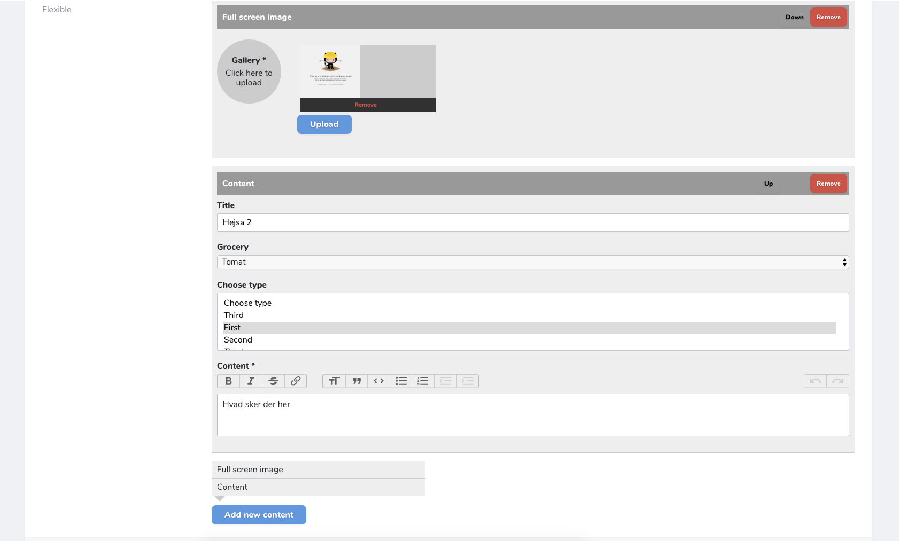

# Laravel nova field: Flexible content

This is a Laravel Nova field which makes it possible to do a flexible setup field, which can be controlled within 1 `json` column in a model.

You can install the field by running the following command:

`composer require gwd/laravel-nova-flexible-content`

Then open the nova resource which should use have the Flexible content field.



## What is required in the Resource?

Its very important that the resource have a column which of type `json` and the field is casts to array:

```
class ... extends Migration
{
   public function up()
   {
      Schema::create('posts', function (Blueprint $table) {
            $table->increments('id');
            $table->json('flexible')->nullable(); // This field

            $table->timestamps();
        });
   }
}
```

And then in the Model:

```
class Post extends Model
{
    protected $casts = [
        'flexible' => 'array'
    ];
}
```

Then you can use the Flexible content field, by doing the following setup:

```
use Gwd\FlexibleContent\FlexibleContent;

class Post extends Resource
{
   ...
   public function fields(Request $request)
   {
       return [
            FlexibleContent::make('Flexible')
                ->addLayout(
                [
                    'label' => 'Full screen image',
                    'name' => 'full_image',
                    'fields' => [
                        [
                            'type' => 'text',
                            'name' => 'title',
                            'placeholder' => 'Enter a title here',
                            'required' => true
                        ],
                        [
                            'type' => 'image',
                            'name' => 'image',
                            'label' => 'Image',
                            'multiple' => false,
                            'required' => true
                        ]
                    ]
             ])
       ];
   }
}
```

In the above example you get the following output in the flexible column:

```
[
  {
    "data": {
      "title": "This is a title",
      "image": "IMAGE-PATH-HERE",
    },
    "type": "full_image"
  }
]
```
